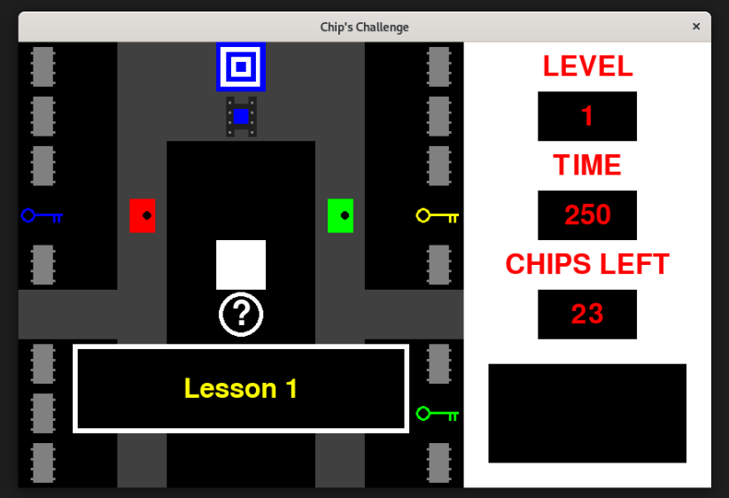

# The Challenge
## Description
A non-original game written in Pygame for fun.

"The Challenge" is an emulation of the game "Chip's Challenge" (1989), originally written for the Atari Lynx by Chuck Sommerville, and later ported to MS Windows by Microsoft.

The board is a square grid. You control the Player (in my version it is a white square). The goal of each level is to reach the Exit. Usually you will have to collect chips, keys or shoes, and you will have to avoid the monsters. Some levels are intellectual puzzles, others require some degree of agility.

Good luck!

## How to get started
To run it on your computer, follow these steps:

1) copy the reposity on your computer using the following command:

   git clone PaoloTognini/The_Challenge

2) install the requirements.txt (essentially containing the python library Pygame) using the following command:

   pip3 install requirements.txt

3) start to play the game using the following command:

   python3 the_challenge_00.py

4) have fun!
